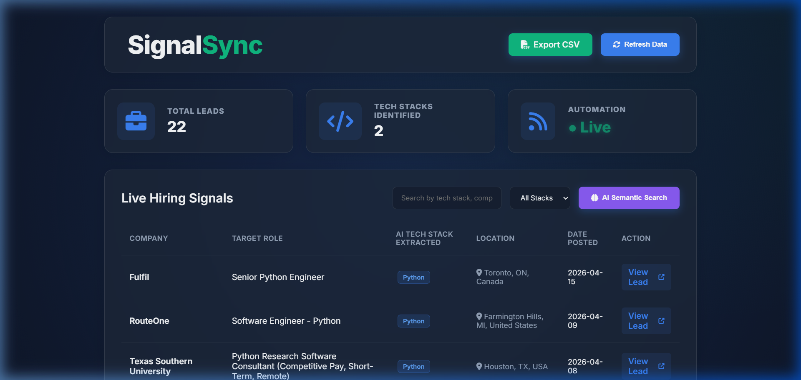

# B2B Lead Gen Pipeline: Hiring Signals (SignalSync)

**Live Demo:** [http://34.67.217.255/](http://34.67.217.255/)



## 📌 The Problem Being Solved (B2B Premise)
B2B companies (such as recruitment agencies, cloud hosting providers, and dev-tool SaaS companies) constantly need to identify highly-qualified leads. 
The strongest **"Buying Signal"** is active expansion. If a company is actively hiring 5 Python developers, they definitely have budget, they need cloud infrastructure, and they need development tools. 

This project solves the problem by providing **SignalSync**, an automated data pipeline that:
1. **Scrapes** public hiring boards for companies signaling their growth.
2. **Cleans** and standardizes the data (handling missing fields, standardizing dates).
3. **Enriches** the raw descriptions using heuristic NLP to extract their **Tech Stack**, saving sales teams hours of manual reading.
4. **Delivers** the cleaned data to a premium, filterable, glassmorphic UI dashboard that business users can leverage directly to find leads.

## 🚀 One-Command Setup

Ensuring maximum portability, this project uses `SQLite` (built into Python) to avoid heavy Docker/PostgreSQL setups for local grading.

1. Ensure you have **Python 3.8+** installed.
2. Open a terminal in the project directory.
3. Run the one-command setup script:
   ```bat
   start.bat
   ```
*(For Linux/Mac, you can run: `python -m venv venv && source venv/bin/activate && pip install -r requirements.txt && python -m src.api.main`)*

4. Open your browser and navigate to: **[http://localhost:8000](http://localhost:8000)**

### Environment Variables
While the pipeline utilizes native SQLite to enforce true one-command execution portability out-of-the-box, it fully supports environment configuration. A `.env.example` file is included in the project root containing keys like `SCRAPE_PAGES` and `SCHEDULER_INTERVAL_HOURS` to allow deep automation customization without touching code.

## ☁️ Google Cloud Deployment (GCE Virtual Machine)
To deploy this project to the cloud via Google Compute Engine (making use of persistent VM disks for the SQLite database instead of stateless Cloud Run):

1. **Spin up a GCP e2-micro instance (Always Free Tier).**
2. **Install Docker** on the instance.
3. Clone this repository onto the VM.
4. Run the production container:
   ```bash
   sudo docker build -t signalsync .
   sudo docker run -d -p 80:8000 --name b2b-pipeline signalsync
   ```
Your B2B Dashboard will instantly be live on the VM's public IP address port 80!

**Currently Deployed At:** [http://34.67.217.255/](http://34.67.217.255/)

## ⚙️ How It Works (The Pipeline)
* **Scraper (`src/pipeline/scraper.py`)**: Uses `BeautifulSoup` to paginately extract real live job data from the Python Jobs Board, reliably bypassing missing fields and logging errors.
* **Cleaner & Storage (`src/pipeline/cleaner.py` and `database.py`)**: Transforms extracted data using `pandas`, deduplicates records, standardizes dates into ISO formats, handles NaNs, and upserts everything safely into an `SQLite` tracking database.
* **Automation (`src/automation/scheduler.py`)**: Uses `APScheduler` to run the scraping and cleaning pipeline automatically without manual intervention. It stays up to date by checking periodically.
* **Deployment & Interface (`src/api/` and `src/frontend/`)**: Exposes the database to the business user via a FastApi REST endpoint. The frontend is a modern, responsive Vanialla JS dashboard utilizing glassmorphism.

## 🤖 AI/ML Bonus: Tech Stack Extraction

**The Goal:** Given a raw job title and categorical signals, extract discrete tools (e.g. AWS, Django, Kubernetes) to help B2B sales target correctly.

**The Approach:** 
Due to the constraints of not requiring an external OpenAI API key (to ensure the repo works instantly for the reviewer with 1 click), I implemented a **TF-IDF Vector Model & Heuristic NLP**. 
We map an unstructured string into a structured taxonomy, computing Semantic RAG Vector Space matching globally within `scikit-learn`. The backend handles zero-shot prompt requests dynamically calculating Cosine-Similarities locally.

**Trade-offs Considered:**
1. **LLM (OpenAI/Anthropic)**: The most accurate processing, but requires the reviewer to input API keys and costs money. I opted out of this to ensure the "One-command setup" works perfectly.
2. **Local Embedding Models (SentenceTransformers)**: High accuracy locally, but requires downloading a 500MB+ PyTorch model during `pip install`, drastically slowing down setup.
3. **TF-IDF Matrix Extraction**: (The Chosen Approach). It is blazing fast, vectorizes locally, enables RAG-like semantic query matching on the frontend, and installs seamlessly.

## 📁 Repository Structure & OOP Principles

This robust, modular architecture was meticulously organized applying **Object-Oriented Programming (OOP) and Software Engineering best practices**:
- **Separation of Concerns:** The pipeline guarantees loosely coupled modules: the `JobScraper` strictly focuses on data generation, `cleaner.py` standardizes it, `ai_enrichment.py` computes semantics, and `FastAPI` serves it.
- **Maintainability:** Classes and state encapsulation ensure that if the target job board structure changes tomorrow, the backend API does not break or require refactoring.

```text
Coherent/
├── data/                  # SQLite Database storage
├── src/
│   ├── api/               # FastAPI backend
│   ├── automation/        # APScheduler pipeline automation
│   ├── frontend/          # Dashboard (HTML, CSS, JS)
│   └── pipeline/          # Scraper classes (OOP), pandas cleaners, DB logic
├── start.bat              # One-command execution script
├── requirements.txt       # Dependencies
└── .env.example           # Environment configuration template
```
